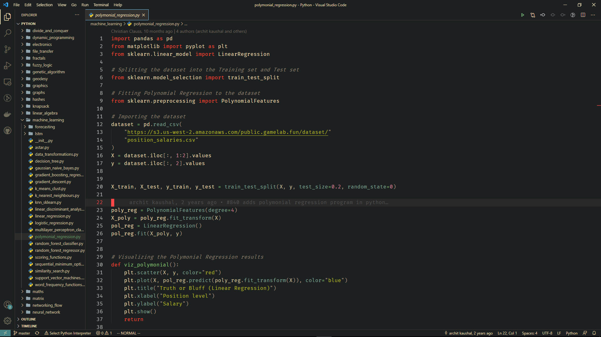

# VSCode Setup
My personal visual studio code setup.

## Theme :
[Deepdark material theme | Full Black Version.](https://marketplace.visualstudio.com/items?itemName=Nimda.deepdark-material) 

## Icon theme :
[Material icon theme.](https://marketplace.visualstudio.com/items?itemName=PKief.material-icon-theme) 

## Extensions :
1. [Vim](https://marketplace.visualstudio.com/items?itemName=vscodevim.vim) 
2. [Docker](https://marketplace.visualstudio.com/items?itemName=ms-azuretools.vscode-docker) 
3. [Python](https://marketplace.visualstudio.com/items?itemName=ms-python.python) 
4. [Jupyter](https://marketplace.visualstudio.com/items?itemName=ms-toolsai.jupyter) 
5. [Remote Containers](https://marketplace.visualstudio.com/items?itemName=ms-vscode-remote.remote-containers) 
6. [Remote WSL](https://marketplace.visualstudio.com/items?itemName=ms-vscode-remote.remote-wsl) 
7. [Markdownlint](https://marketplace.visualstudio.com/items?itemName=DavidAnson.vscode-markdownlint) 

## How to replicate this setup :
1. Copy then settings.json file from this repository to:  
    **Windows** %APPDATA%\Code\User\settings.json 
    **macOS** $HOME/Library/Application Support/Code/User/settings.json 
    **Linux** $HOME/.config/Code/User/settings.json 
2. Then install the theme and icon theme.
3. (Optional) install the extensions.
